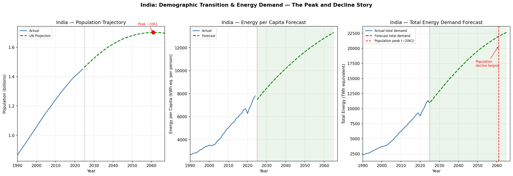
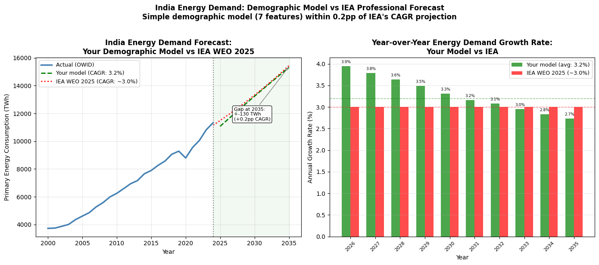
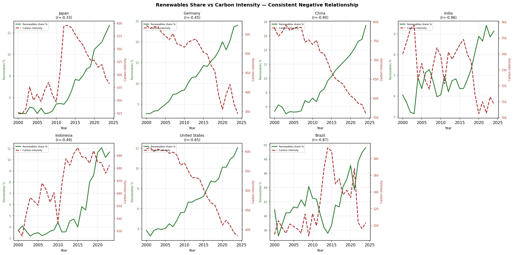
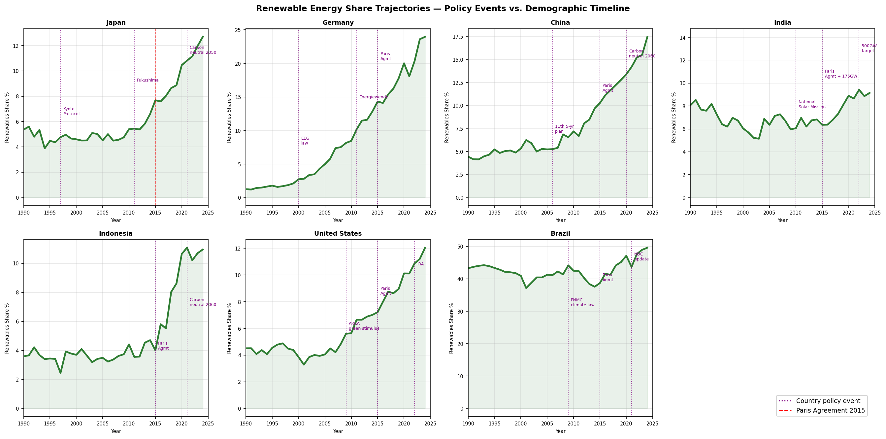
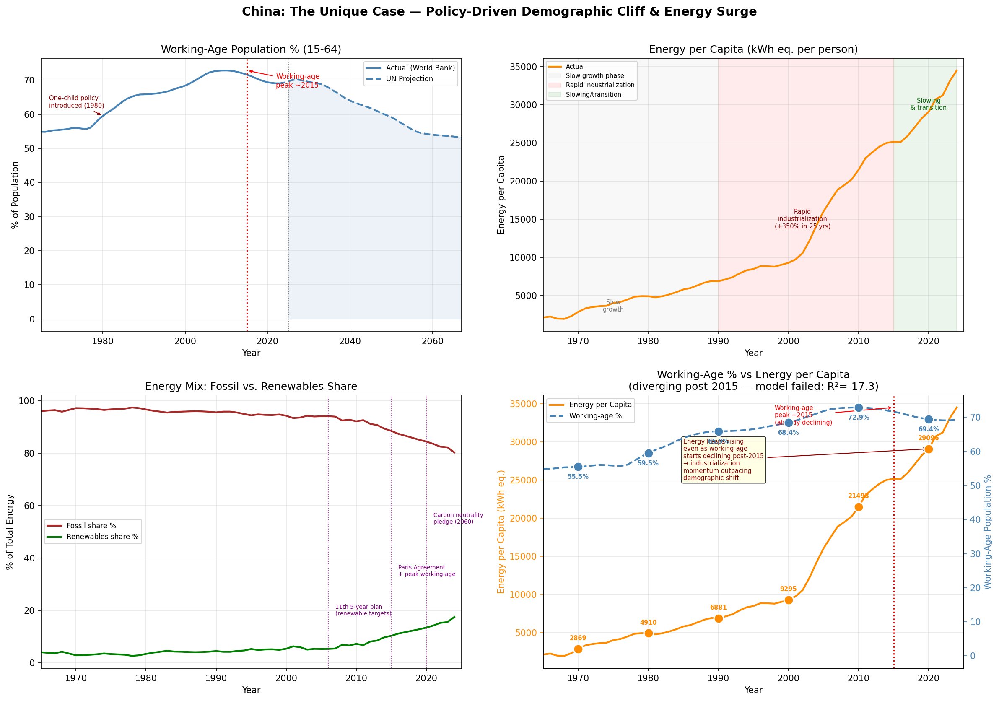

# Demographic Drivers of Energy Demand

### A Country-Level Analysis with 10-Year Forecasts

> **Can population aging and demographic change predict energy demand and renewable adoption?**  
> This project tests that question rigorously across 7 countries and 60 years of data — and finds the answer is more nuanced than it first appears.

---

## Quick Summary

|                    |                                                                                                                                     |
| ------------------ | ----------------------------------------------------------------------------------------------------------------------------------- |
| **Countries**      | India, Indonesia, China, Germany, Japan, USA, Brazil                                                                                |
| **Time period**    | 1960–2024 (actuals) + 2025–2065 (UN projections)                                                                                    |
| **Best model**     | Ridge regression, India: R²=0.905, MAE=2.9%                                                                                         |
| **IEA validation** | Model CAGR 3.2% vs IEA WEO 2025 projection ~3.0% (+0.2pp)                                                                           |
| **Core finding**   | Demographics predicts energy _demand_ in stable developing economies; energy _mix_ is driven by policy/technology, not demographics |

---

## Key Findings

**1. Demographics reliably predicts energy demand — but only in stable developing economies**

India and Indonesia show strong, backtested demographic-demand relationships (R²=0.905 and R²=0.472 respectively). The same model fails for Japan, Germany, and the USA — where policy shocks (Fukushima 2011, Energiewende) or structural economic transitions override demographic signals.

**2. Apparent strong correlations were largely spurious**

Raw correlations between aging and energy mix looked strong (r=0.71–0.98). After controlling for shared time trends via year-over-year differencing, these collapsed to near-zero (-0.24 to 0.55). Two independent upward trends coinciding in time, not a real relationship.

**3. Simpson's Paradox in pooled demographic-energy correlations**

Naive pooling of countries into demographic-phase groups showed urbanization _negatively_ correlated with low-carbon energy in the "declining" group — the opposite of what every individual country showed. Fixed via within-country de-meaning before pooling.

**4. Carbon intensity of electricity is the real driver of renewable adoption**

The only variable showing consistent direction vs. renewable share across all 7 countries after trend-confounding tests: carbon intensity of electricity (r = -0.33 to -0.96). Policy/technology, not demographics, drives the energy mix.

**5. India's demographic model matched IEA's professional forecast within 0.2pp CAGR**

A 7-feature demographic model trained on data through 2010 produced a 2025–2035 energy demand forecast for India with an implied CAGR of 3.2% — within 0.2 percentage points of IEA's World Energy Outlook 2025 (~3.0%). IEA uses full sector-by-sector policy scenario modeling; this model uses only publicly available demographic and economic data.

---

## Charts

### India: Demographic Transition & Energy Demand


_India's total energy demand is projected to nearly triple by population peak (~2061). Post-peak, per-capita demand continues rising but total demand growth decelerates — signaling a shift from "build more" to "build smarter."_

---

### India vs IEA WEO 2025


_A simple 7-feature demographic model produces a 10-year energy demand forecast within 0.2pp CAGR of IEA's professional projection._

---

### Renewables Share vs Carbon Intensity — All Countries


_Carbon intensity of electricity shows a consistent negative relationship with renewable share across all 7 countries (r = -0.33 to -0.96) — the only variable to do so after controlling for trend confounding._

---

### Policy Events vs Demographic Timeline


_Renewable share inflections align with policy events (Paris Agreement 2015, Energiewende, China's 5-year plans) — not with demographic transition points._

---

### China: The Unique Case


_China shows the clearest demographic-renewable signal in EDA (r=0.49), but the predictive model failed (R²=-17.3) because its post-2010 industrialization pace exceeded anything in its own historical training data._

---

## Three-Tier Country Classification

| Country      | Tier                      | Model R²           | Why                                                                        |
| ------------ | ------------------------- | ------------------ | -------------------------------------------------------------------------- |
| 🇮🇳 India     | Tier 1 — Model Works      | 0.905              | Stable developing economy, gradual demographic shift                       |
| 🇮🇩 Indonesia | Tier 1 — Model Works      | 0.472              | Stable relationship, moderate fit                                          |
| 🇧🇷 Brazil    | Tier 2 — Structural Break | -0.900 (CV: 0.826) | Model learned history well; 2014–16 political crisis broke the test period |
| 🇨🇳 China     | Tier 3 — Policy Dominated | -17.3              | Industrialization pace 2011–2024 exceeded training history                 |
| 🇩🇪 Germany   | Tier 3 — Policy Dominated | -2.5               | Energiewende created post-2010 structural break                            |
| 🇯🇵 Japan     | Tier 3 — Policy Dominated | -29.0              | Fukushima 2011 nuclear shutdown — irreversible structural break            |
| 🇺🇸 USA       | Tier 3 — Policy Dominated | -23.8              | Energy efficiency decoupled from GDP post-2005                             |

---

## Methods

### Statistical techniques

- **Panel data analysis** — cross-country + time-series, explicit separation of within-country vs. between-country variation
- **Lag feature engineering** — 1-year lags to align "last year's demographics → this year's energy," reflecting realistic infrastructure response delays
- **First-differencing** — year-over-year changes to remove shared time trends before correlation testing
- **Fixed-effects de-meaning** — within-country mean subtraction before pooling, to avoid Simpson's Paradox
- **Ridge regression with cross-validation** — RidgeCV with 5-fold CV; preferred over Random Forest given small per-country sample sizes (~46 training rows)
- **Bias calibration** — World Bank/UN source offset correction at the 2024 data-source splice point
- **10-year correlation analysis** — `.diff(10)` to test demographic-energy relationships at the timescale demographics actually operates on

### Why not Random Forest?

Initial models used Random Forest and showed catastrophically negative CV R² (-46 to -198), indicating severe overfitting. With only 4–7 countries per group and ~46 training rows per country, tree-based models memorize country-specific histories rather than learning generalizable rules. Ridge regression's explicit regularization and linear structure is more appropriate for this data size.

### Why per-country models?

Group models (developing vs. mature) still showed negative CV R² because a model trained on Brazil/China/Indonesia has no basis for predicting India — these are structurally different economies. Per-country models correctly ask "does Japan's own history predict Japan's future" — a tractable question — rather than "does Japan teach us about India."

---

## Data Sources

| Source                                                                                 | What                                                                | Coverage  |
| -------------------------------------------------------------------------------------- | ------------------------------------------------------------------- | --------- |
| [World Bank API](https://data.worldbank.org/)                                          | Population, GDP, urbanization, age structure                        | 1960–2024 |
| [Our World in Data — Energy](https://ourworldindata.org/energy)                        | Energy consumption, renewable share, fossil share, carbon intensity | 1965–2024 |
| [UN World Population Prospects 2024](https://population.un.org/wpp/)                   | Age-structure projections (% 65+, working-age %)                    | 2025–2065 |
| [IEA World Energy Outlook 2025](https://www.iea.org/reports/world-energy-outlook-2025) | India energy demand projection (3% CAGR benchmark)                  | 2025–2035 |

---

## Repo Structure

```
demographic-energy-project/
│
├── notebooks/
│   ├── 01_data_collection.ipynb       # World Bank + OWID + UN data pulls
│   ├── 02_merge_and_classify.ipynb    # Merge, null handling, phase classification
│   ├── 03_eda.ipynb                   # All EDA charts + correlation analysis
│   ├── 04_modeling.ipynb              # Ridge regression per country
│   ├── 05_forecasting_and_case_studies.ipynb  # Forecasts, India 3-panel, IEA comparison
│   └── 06_results_summary.ipynb      # Three-tier table, key findings
│
├── data/
│   └── processed/
│       ├── actuals_final.csv          # Merged panel: 7 countries, 1960-2024
│       ├── model_df.csv               # Actuals with lag features
│       ├── age_clean.csv              # UN age-structure projections, calibrated
│       ├── forecast_df.csv            # IND + IDN 10-year forecasts
│       ├── forecast_ind_ext.csv       # India extended forecast to 2065
│       └── three_tier_results.csv     # Country classification table
│
├── outputs/
│   ├── india_demographic_energy_forecast.png
│   ├── india_iea_comparison.png
│   ├── india_analysis.png
│   ├── china_analysis.png
│   ├── renewables_vs_carbon_intensity.png
│   ├── policy_energy_mix_chart.png
│   ├── eda_within_country_heatmap.png
│   └── eda_simpsons_paradox.png
│
├── requirements.txt
└── README.md
```

---

## How to Run

```bash
# Install dependencies
pip install -r requirements.txt

# Run notebooks in order in Google Colab or Jupyter
# 01 → 02 → 03 → 04 → 05 → 06
# Each notebook saves CSVs that the next one loads
```

**requirements.txt**

```
pandas
numpy
matplotlib
seaborn
scikit-learn
requests
wbgapi
```

---

## Limitations

- **Small sample:** 7 countries is enough to identify patterns but not to claim universal generalizability. Findings are exploratory, not statistically confirmatory in a formal sense.
- **Nigeria excluded:** insufficient OWID renewable energy data coverage to produce usable training rows; included in EDA population analysis only.
- **GDP/urbanization projections:** UN WPP provides demographic structure projections; GDP per capita and urbanization for 2025–2065 are extrapolated using recent trend (5-year average annual change), not a formal economic forecast.
- **Recursive forecast error:** the 10-year forecast uses each predicted year's features to predict the next year. Errors compound over the forecast horizon — treat directional trends as more reliable than specific numbers, especially beyond 2030.
- **Energy mix not modeled:** renewable and fossil share are explicitly not modeled (carbon intensity analysis confirms they are policy-driven, not demographic-driven). The model only forecasts total energy demand.
- **Data center / AI energy demand:** not incorporated. A growing non-demographic demand driver, particularly for the USA. Noted as a future work direction.

---

## Future Work

- Extend to a larger country set (20–30 countries) to improve cross-country model generalizability
- Add carbon intensity and policy dummy variables to test whether a hybrid demographic + policy model outperforms either alone
- Test whether energy-sector equity returns in high-demand-growth countries (India, Indonesia) outperformed declining-demand countries (Japan, Germany) over 2014–2024
- Incorporate IEA sector-level energy demand projections as a richer benchmark for model validation

## Attempted Extension: Causal Inference via Synthetic Control

As an extension beyond standard correlational analysis, a synthetic control approach was
attempted to causally identify the effect of China's one-child policy (1980) on energy demand.

**Setup:** China as the treated unit; India, Indonesia, and Brazil as donor countries.
Optimal weights were estimated by minimizing pre-1980 energy per capita difference between
China and the synthetic counterfactual.

**Result:** Synthetic control weights — India: 0.286, Indonesia: 0.286, Brazil: 0.428.
Pre-treatment fit was poor (MSPE = 598,590), indicating no weighted combination of available
controls adequately reproduces China's pre-1980 energy trajectory.

**Why it failed:** China operated as a centrally planned economy during 1960–1980, making it
structurally incomparable to the market economies used as controls. The parallel trends
assumption required for both DiD and synthetic control was violated even before the policy.

**What this means:** Causal identification of the one-child policy's energy demand effect
would require province-level data within China, where variation in policy enforcement
intensity provides within-country treatment variation — a cleaner natural experiment than
cross-country comparison.

**Takeaway:** The attempt itself confirmed that cross-country causal inference on this
question requires more granular data than publicly available country-level sources provide.

---

_Built as a self-learning and self-directed data science project. Data from publicly available sources (World Bank, OWID, UN, IEA)._
